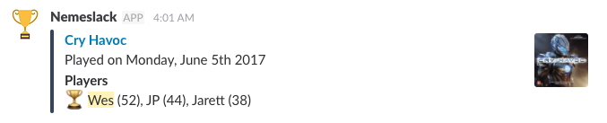

# Nemeslack

A simple way to send [Nemestats][nemestats] plays to Slack:

## Installation

At the moment you'll need your own instance for your Slack. I run mine on Zeit's Now (for free) and it works really well.

1. Create [a new Slack app](https://api.slack.com/apps?new_app=1)
2. Enable Incoming Webhooks
3. Create a Webhook URL for the desired channel and team
4. Clone this repository
5. Copy/rename `now.json.example` to `now.json`
6. Change the `GAMING_GROUP_ID` in `now.json` to match your [Nemestats][nemstats] group ID (e.g. with a url of `https://nemestats.com/GamingGroup/Details/13468` your ID is `13468`)
7. Add the following secrets to your now project:
    - `now secret add nemeslack_sentry_dsn <your sentry.io DSN>`
    - `now secret add nemeslack_slack_webhook_url <your slack webhook url>`
8. Deploy to [Now](https://zeit.co/docs/v2/deployments/basics/)
9. Create an alias for your Now deployment (e.g. `now alias https://project-234asf3.now.sh/ project.now.sh`)
10. Use something like [cron-job.org](https://cron-job.org/) to schedule a recurring job, daily is usually enough.

[nemestats]: https://nemestats.com
